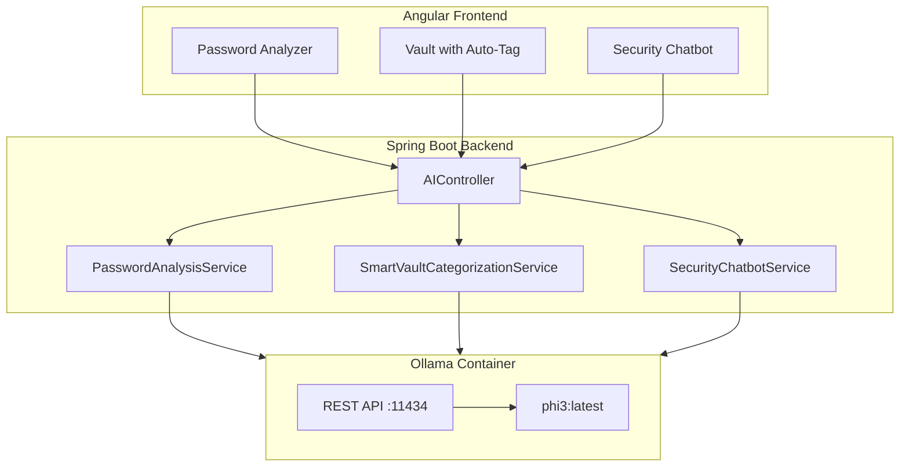

# Local LLM Integration Plan for Rev Password Manager

## Hardware Constraints
- **GPU**: NVIDIA RTX 3050 with 4GB VRAM
- **RAM**: 16GB DDR4

---

## LLM Selection

### Primary Model: phi3:latest (3.8B Parameters)
| Specification | Value |
|---------------|-------|
| VRAM Required | ~4GB (fits RTX 3050) |
| Performance | Excellent for security/code tasks |
| License | MIT |
| Why | Microsoft-designed for local/edge, excels at security tasks |

### Docker Engine: Ollama
- Using the **existing** `ollama` Docker container already running on the host.
- The `phi3:latest` model is already pulled and running.
- Exposes REST API on port `11434`.

---

## Architecture Overview



---

## Implementation Phases

### Phase 1: Environment & Connectivity Setup

Since the Ollama container and `phi3:latest` model are already installed and running, we only need to configure the backend to connect to it.

#### 1.1 Add .env Configuration
If the backend is running in a Docker container, we use `host.docker.internal` (or the host's IP) to connect to Ollama. If running natively, we use `localhost`.
```env
# LLM Configuration
LLM_BASE_URL=http://localhost:11434
LLM_MODEL=phi3
LLM_TEMPERATURE=0.7
```

---

### Phase 2: Backend Implementation

#### 2.1 Add Dependencies (pom.xml)
```xml
<!-- OkHttp for HTTP client -->
<dependency>
    <groupId>com.squareup.okhttp3</groupId>
    <artifactId>okhttp</artifactId>
    <version>4.12.0</version>
</dependency>

<!-- JSON Processing -->
<dependency>
    <groupId>com.fasterxml.jackson.core</groupId>
    <artifactId>jackson-databind</artifactId>
</dependency>

<!-- Reactive WebFlux for streaming (if implementing Chatbot stream) -->
<dependency>
    <groupId>org.springframework.boot</groupId>
    <artifactId>spring-boot-starter-webflux</artifactId>
</dependency>
```

#### 2.2 Create LLM Configuration
**File**: `src/main/java/com/revature/passwordmanager/config/LlmConfig.java`
```java
@Configuration
@ConfigurationProperties(prefix = "llm")
@Data
public class LlmConfig {
    private String baseUrl;
    private String model;
    private double temperature = 0.7;
    private int timeoutSeconds = 60;
}
```

#### 2.3 Create LLM Client Service
**File**: `src/main/java/com/revature/passwordmanager/service/ai/LlmClientService.java`
```java
@Service
@RequiredArgsConstructor
public class LlmClientService {
    
    private final LlmConfig config;
    private final OkHttpClient httpClient;
    private final ObjectMapper objectMapper;
    
    /**
     * Send prompt to Ollama API and get completion
     */
    public String generateCompletion(String systemPrompt, String userPrompt) {
        // Build request payload for Ollama POST /api/chat or /api/generate
        // Return response content
    }
    
    /**
     * Stream completion for chatbot
     */
    public Flux<String> streamCompletion(String systemPrompt, String userPrompt) {
        // Use WebClient for streaming responses from Ollama API
    }
    
    public boolean isHealthy() {
        // Check http://localhost:11434/ endpoint
    }
}
```

#### 2.4 Create Feature A: Password Analysis Service
**File**: `src/main/java/com/revature/passwordmanager/service/ai/PasswordAnalysisService.java`
```java
@Service
@RequiredArgsConstructor
public class PasswordAnalysisService {
    
    private final LlmClientService llmClient;
    
    public PasswordAnalysisResult analyzePassword(String password) {
        String systemPrompt = """
            You are a cybersecurity expert specializing in password security.
            Analyze the given password and provide:
            1. Strength rating (VERY_WEAK/WEAK/MODERATE/STRONG/VERY_STRONG)
            2. List of specific vulnerabilities
            3. Actionable improvement suggestions (max 3)
            Keep responses concise and user-friendly.
            Format your response as JSON with keys: strength, vulnerabilities[], suggestions[]
            """;
        
        String userPrompt = "Analyze this password: '" + password + "'";
        String response = llmClient.generateCompletion(systemPrompt, userPrompt);
        
        return parseAnalysisResponse(response);
    }
}
```

#### 2.5 Create Feature B: Smart Vault Categorization Service
**File**: `src/main/java/com/revature/passwordmanager/service/ai/SmartVaultCategorizationService.java`
```java
@Service
@RequiredArgsConstructor
public class SmartVaultCategorizationService {
    
    private final LlmClientService llmClient;
    
    public CategorizationResult categorizeEntry(String url, String username, String title) {
        String systemPrompt = """
            You are a credential categorizer for a password manager.
            Based on the provided URL, username, and title, suggest:
            1. Category (one of: WORK, PERSONAL, SOCIAL, FINANCE, SHOPPING, DEVELOPMENT, EDUCATION, ENTERTAINMENT, OTHER)
            2. Tags (array of relevant tags, max 5)
            3. Confidence score (0.0 to 1.0)
            
            Return JSON with keys: category, tags[], confidence
            """;
        
        String userPrompt = """
            URL: %s
            Username: %s
            Title: %s
            """.formatted(url, username, title);
        
        String response = llmClient.generateCompletion(systemPrompt, userPrompt);
        return parseCategorizationResponse(response);
    }
}
```

#### 2.6 Create Feature C: Security Chatbot Service
**File**: `src/main/java/com/revature/passwordmanager/service/ai/SecurityChatbotService.java`
```java
@Service
@RequiredArgsConstructor
public class SecurityChatbotService {
    private final LlmClientService llmClient;
    
    // Manage session history in memory or database
    public ChatResponse chat(Long userId, String message) {
        // Provide security Chatbot functionality
    }
}
```

#### 2.7 Create AI Controller
**File**: `src/main/java/com/revature/passwordmanager/controller/AIController.java`
Provides endpoints like:
- `POST /api/ai/analyze-password`
- `POST /api/ai/categorize-entry`
- `POST /api/ai/chat`
- `GET /api/ai/health`

---

### Phase 3: Frontend Implementation

#### 3.1 Add Password Analyzer Component
**File**: `frontend/src/app/features/ai/password-analyzer/password-analyzer.component.ts`
UI for user to type in a password and get AI-powered security feedback.

#### 3.2 Add Auto-Tag Feature to Vault Entry
**File**: `frontend/src/app/features/vault/add-entry-dialog.component.ts`
A button that calls `/api/ai/categorize-entry` to suggest tags and categories.

#### 3.3 Add Security Chatbot Component
**File**: `frontend/src/app/features/ai/chatbot/chatbot.component.ts`
A floating chatbot or dedicated page to discuss security best practices.

#### 3.4 Update API Service
**File**: `frontend/src/app/core/api/api/aIPasswordAssistant.service.ts`

---

### Phase 4: Configuration & Security

#### 4.1 Update application.properties
```properties
# LLM Configuration
llm.base-url=${LLM_BASE_URL:http://localhost:11434}
llm.model=${LLM_MODEL:phi3}
llm.temperature=0.7
llm.timeout-seconds=60
```

#### 4.2 Update Security Config
Ensure `/api/ai/health` might be accessible without auth, but other `/api/ai/**` endpoints require authentication.

---

## Feature Summary

| Feature | Endpoint | Description |
|---------|----------|-------------|
| **A: Password Analysis** | POST `/api/ai/analyze-password` | AI analyzes password strength with detailed feedback |
| **B: Auto-Categorization** | POST `/api/ai/categorize-entry` | AI suggests category/tags for new credentials |
| **C: Security Chatbot** | POST `/api/ai/chat` | Interactive Q&A about security topics |

---

## Testing Plan

### Unit Tests
- LlmClientService: Test API communication with Ollama Mock
- PasswordAnalysisService: Test prompt generation
- SmartVaultCategorizationService: Test categorization logic

### Integration Tests
- AIController endpoints with test LLM
- Full flow from frontend to LLM

### Performance Tests
- Response time < 10 seconds for password analysis
- Chatbot streaming latency
- Memory usage under 8GB total
